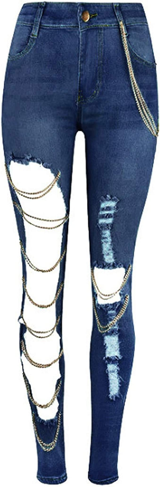
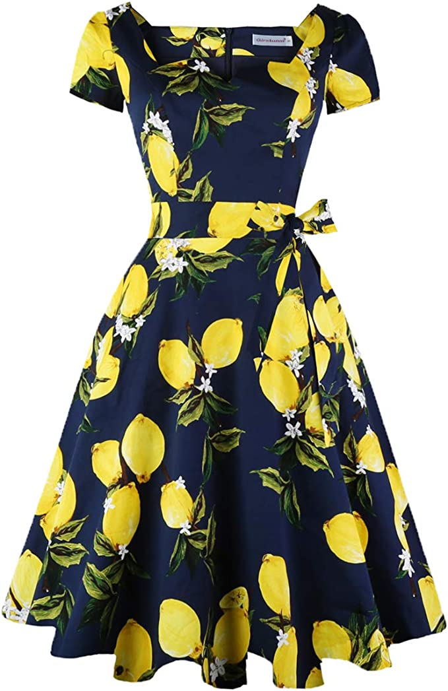
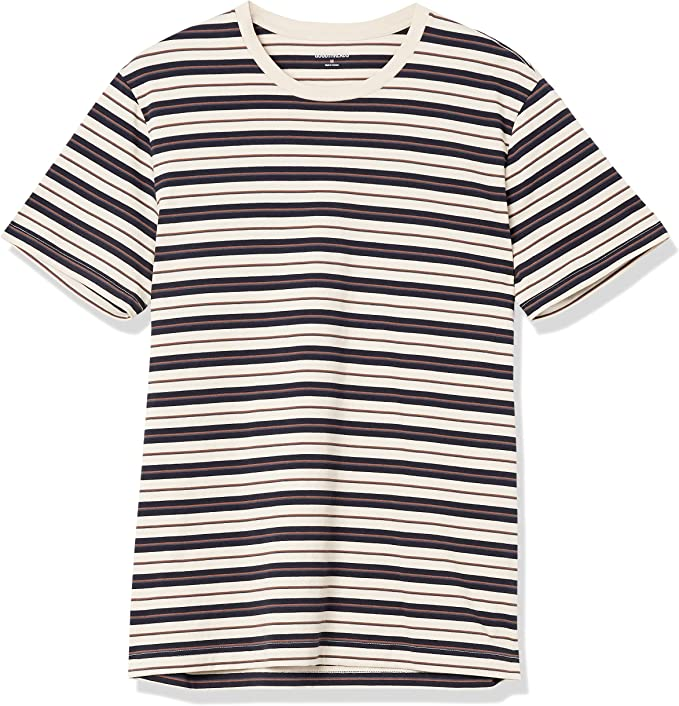

# Lab 11 
## 8/8/2022

### Checkpoint 1 

I ran the code but also needed to install tkinter. 

### Checkpoint 2 
Image 9000 - 9014   

In line 133 I changed i to i+9000:  

### Checkpoint 3 

Image 1 (jeans):      
     
     
     
      

Image2 (dress)      
     
    
    
    

Image3 (T-shirt)     
    
     
    
     

Seems like everything is a bag...... 0/3

